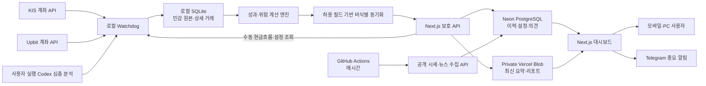
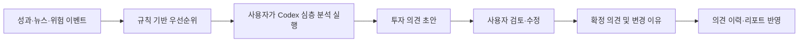

# Watchdog 투자 의사결정 대시보드 v2 설계

- 작성일: 2026-06-06
- 상태: 구현 계획 작성 전 승인 설계
- 대상: 로컬 Portfolio Watchdog, Next.js 대시보드, Vercel, Neon PostgreSQL, Vercel Blob

## 1. 목적

Watchdog v2는 단순한 최신 자산 현황 화면이 아니라, 다음 질문에 빠르게 답하는 개인용 투자 의사결정 대시보드다.

1. 현재 자산과 실제 투자 성과는 얼마인가?
2. 입출금을 제외한 성과가 벤치마크보다 좋았는가?
3. 목표 비중과 비교해 어떤 자산이 과대·과소 배분됐는가?
4. 어떤 뉴스, 리스크, 투자 논거 변화가 지금 확인할 가치가 있는가?
5. 최근 판단과 리포트에서 무엇이 달라졌는가?

대시보드는 모바일과 PC에서 동일한 핵심 판단을 제공하되, 민감한 계좌 원본 데이터는 로컬 PC 밖으로 보내지 않는다.

## 2. 확정 원칙

### 2.1 분석 및 비용 원칙

- 클라우드 대시보드는 OpenAI API를 자동 호출하지 않는다.
- 실시간 분류는 규칙 기반으로 수행한다.
- Codex는 사용자가 투자 의견 초안이나 리포트 작성을 실행할 때 심층 분석을 담당한다.
- Codex가 만든 투자 의견은 사용자 검토·수정·확정 과정을 거친다.
- 자동 매매와 무조건적인 매수·매도 지시는 제공하지 않는다.

### 2.2 데이터 보안 원칙

- KIS·Upbit API 키, 계좌 식별자, 주문 식별자, 수량, 체결 가격, 평균 매수가는 로컬에만 저장한다.
- 클라우드에는 비식별 요약, 계산 결과, 설정, 의견, 리포트만 저장한다.
- 클라우드 업로드는 허용 필드 목록 방식으로 생성하며, 원본 객체를 그대로 직렬화하지 않는다.
- 클라우드 데이터만으로 실제 수량이나 계좌를 복원할 수 없어야 한다.

### 2.3 성과 표시 원칙

- `자산 비중`과 `수익률`을 색상, 단위, 위치로 명확히 분리한다.
- 투자 성과의 기본 지표는 입출금 영향을 제거한 TWR(Time-Weighted Return)이다.
- 총자산 변화는 `투자 손익`과 `순입출금`으로 분해한다.
- 홈 화면은 누적 TWR, 당월 TWR, 혼합 벤치마크 대비 초과성과를 우선 표시한다.
- 기존 매입가 대비 평가손익률은 종목 상세에서 `누계 평가손익률`로 명시한다.

## 3. 범위와 제외 범위

### 3.1 v2 범위

- KIS·Upbit 계좌 및 거래내역의 로컬 자동 수집
- 현금 입출금의 대시보드 수동 입력
- 거래·입출금 기반 TWR, 월간 수익률, 벤치마크 계산
- 실제 평가액과 추정 평가액 구분
- 자산 배분, 목표 비중, 성과, 위험, 뉴스, 투자 의견, 리포트 화면
- 규칙 기반 뉴스 영향도 및 위험 신호 선별
- 웹 리포트, PDF 보관, Telegram 중요 알림
- 비밀번호 로그인과 중요 쓰기 작업의 비밀번호 재확인

### 3.2 제외 범위

- 자동 주문 또는 자동 리밸런싱
- 클라우드에서 KIS·Upbit 계좌 API 직접 호출
- 클라우드 저장소에 원본 거래내역 또는 기사 원문 전체 저장
- 공개 시세 공급원이 확정되기 전 PC 오프라인 상태의 ISA 정확한 실시간 평가
- 클라우드 OpenAI API 자동 분석

## 4. 전체 아키텍처



### 4.1 구성요소 책임

| 구성요소 | 책임 | 저장 금지 데이터 |
|---|---|---|
| 로컬 Watchdog | 계좌 조회, 거래 수집, 원본 보관, 성과 계산, 비식별 동기화 | 해당 없음 |
| 로컬 SQLite | 상세 거래, 입출금, 원본 API 응답, 계산 체크포인트 | 클라우드로 직접 복제 금지 |
| Next.js | 로그인, 조회 UI, 수동 현금흐름, 목표 비중·의견 승인, 보호 API | API 키, 수량, 체결가 |
| Neon PostgreSQL | 비식별 이력, 공개 시세, 뉴스 메타데이터, 설정, 의견 | 계좌·주문 식별자, 수량, 평단 |
| Private Blob | 최신 대시보드 요약, 웹/PDF 리포트, 리포트 스냅샷 | 민감 원본 |
| GitHub Actions | 공개 시세와 뉴스 정기 수집 호출 | 계좌 API 키 |
| Codex | Public Equity 관점의 심층 분석 및 리포트 작성 | 자동 상시 실행 없음 |

## 5. 데이터 저장 설계

### 5.1 로컬 SQLite

기존 JSON 이력 저장은 단계적으로 SQLite로 대체한다. SQLite는 민감 원본과 정확한 계산의 기준 저장소다.

| 테이블 | 주요 내용 |
|---|---|
| `account_snapshots` | 실제 계좌 평가 시점, 총액, 제공자 상태 |
| `asset_snapshots` | 자산별 수량, 가격, 평가액, 평단, 손익 |
| `transactions` | 매수, 매도, 배당, 수수료 등 상세 거래 |
| `cash_flows` | 입금, 출금, 외부 현금 흐름 |
| `raw_api_responses` | 장애 조사용 제한 기간 원본 응답 |
| `calculation_checkpoints` | TWR 구간별 계산 결과와 재계산 기준 |
| `sync_outbox` | 클라우드 동기화할 비식별 이벤트와 재시도 상태 |

모든 외부 거래는 제공자와 원본 식별자를 조합한 로컬 고유 키로 중복 적재를 방지한다. 클라우드에는 해당 키 원문 대신 로컬에서 생성한 비가역 동기화 식별자만 보낸다.

### 5.2 Neon PostgreSQL

Neon은 대시보드 조회와 사용자 설정의 기준 저장소다.

| 테이블 | 주요 내용 |
|---|---|
| `portfolio_daily` | 일별 총자산, 투자 손익, 순입출금, TWR, 벤치마크 |
| `asset_group_daily` | ISA·코인·현금의 평가액, 비중, 성과 |
| `asset_summary_daily` | 비식별 종목별 평가액, 비중, 계산 수익률 |
| `manual_cash_flows` | 대시보드에서 입력한 비식별 현금흐름과 로컬 적용 상태 |
| `target_allocations` | 목표 비중 버전과 적용 시점 |
| `public_prices` | 공개 시세와 기준 시각 |
| `news_items` | 기사 제목, 출처, URL, 발행 시각, 분류 결과 |
| `news_asset_links` | 뉴스와 자산·투자 논거의 관계 |
| `theses` | 자산별 확정 투자 논거와 상태 |
| `opinion_drafts` | Codex가 만든 검토 전 초안 |
| `opinion_history` | 사용자 확정 의견과 변경 이유 |
| `alerts` | 위험·데이터·촉매 알림 상태 |
| `reports` | 리포트 메타데이터, Blob 경로, 판단 변화 요약 |
| `audit_events` | 중요한 쓰기 작업 감사 기록 |

### 5.3 Vercel Blob

- `dashboard/latest.json`: 빠른 초기 화면을 위한 최신 요약
- `reports/{report_id}/report.html`: 웹 리포트
- `reports/{report_id}/report.pdf`: 다운로드 및 Telegram 전송용 PDF
- `reports/{report_id}/snapshot.json`: 해당 리포트 계산 시점의 비식별 스냅샷

### 5.4 보존 정책

- 로컬 상세 거래 및 중요 의견: 영구 보존
- 로컬 원본 API 응답: 30일
- 일반 뉴스 메타데이터: 90일
- 중요 뉴스 및 투자 논거 연결: 영구 보존
- 상세 평가 스냅샷: 2년 후 일별 데이터로 압축
- PDF 리포트: 2년
- 로컬 저장공간 기본 상한: 2GB
- 사용량 70%에서 주의, 90%에서 강한 경고

## 6. 데이터 수집 및 동기화

### 6.1 로컬 실제 계좌 수집

PC가 켜져 있을 때 Windows 작업 스케줄러가 다음 시각에 실제 계좌 데이터를 수집한다.

- 08:00
- 12:00
- 18:00
- 22:00

각 실행은 다음 순서를 따른다.

1. KIS·Upbit 토큰과 API 상태를 확인한다.
2. 마지막 성공 시점 이후 거래·입출금 내역을 페이지네이션하여 증분 수집한다.
3. 현재 보유자산과 계좌 평가액을 조회한다.
4. 거래 합계와 현재 보유 현황을 대조한다.
5. 대시보드에서 입력한 미적용 수동 현금흐름과 최신 설정을 내려받는다.
6. TWR와 위험 지표를 재계산한다.
7. 비식별 요약을 `sync_outbox`에 넣고 클라우드에 동기화한다.
8. 반영된 수동 현금흐름의 적용 상태를 클라우드에 회신한다.

Upbit와 KIS의 현재 공식 거래·체결 조회 API를 사용하며, 폐기된 과거 전체 주문 API에 의존하지 않는다. API가 제공하지 못하는 현금 이동은 수동 현금흐름으로 보완한다.

### 6.2 공개 시세와 뉴스 수집

Vercel Hobby Cron의 실행 빈도 제한 때문에 시간 단위 작업은 GitHub Actions를 사용한다.

- 공개 시세: 매시간
- 뉴스: 2시간마다
- 일별 집계: 매일 장 마감 이후

GitHub Actions는 정각 혼잡을 피한 분 단위에 실행하며, 보호된 Next.js API를 호출한다. 스케줄 지연 가능성이 있으므로 모든 화면은 데이터 기준 시각과 신선도 상태를 표시한다.

### 6.3 실제값과 추정값

모든 평가 데이터는 다음 상태 중 하나를 가진다.

- `actual`: 계좌 API로 확인된 실제 평가
- `estimated`: 마지막 실제 평가액에 공개 가격 변화를 적용한 추정
- `stale`: 허용 신선도 기준을 초과한 마지막 값
- `fallback`: 기본값 또는 대체 제공자를 사용한 값

PC가 꺼져 있을 때 코인은 마지막 실제 평가액과 공개 Upbit 가격 변화를 이용해 추정할 수 있다. ISA는 승인된 공개 시장 데이터 공급원이 정해지기 전까지 마지막 실제 평가액을 유지하고 `stale`로 표시한다. ISA를 정확한 실시간 값처럼 표시하지 않는다.

### 6.4 동기화 실패 처리

- 모든 적재와 업로드는 같은 이벤트를 다시 실행해도 결과가 중복되지 않아야 한다.
- 네트워크 실패는 지수 백오프로 재시도한다.
- 반복 실패한 이벤트는 `sync_outbox`에 남겨 다음 실행에서 재시도한다.
- 거래내역과 보유 현황이 맞지 않으면 성과를 확정하지 않고 `reconciliation_required` 알림을 생성한다.
- 원본 오류 상세는 로컬 로그에만 남기고 클라우드에는 오류 유형과 상태만 보낸다.

## 7. 성과 및 벤치마크 계산

### 7.1 TWR

외부 현금흐름 전후로 평가 기간을 분리하고 각 구간 수익률을 기하 연결한다.

```text
구간 수익률 = (구간 말 평가액 - 구간 중 외부 순현금흐름) / 구간 초 평가액 - 1
누적 TWR = 각 구간의 (1 + 구간 수익률)을 곱한 값 - 1
```

현금흐름이 누락됐거나 거래 대사가 맞지 않으면 해당 기간 TWR를 `잠정`으로 표시한다. 수동 현금흐름 입력은 적용 시점과 금액을 필수로 받는다.
수동 현금흐름은 대시보드에서 입력 즉시 `적용 대기`로 표시하고, 로컬 Watchdog이 내려받아 계산에 반영한 뒤 `적용 완료`로 전환한다.

### 7.2 화면별 수익률

| 화면 | 기본 수익률 | 보조 지표 |
|---|---|---|
| 홈 | 누적 TWR, 당월 TWR | 혼합 벤치마크 초과성과 |
| 성과 | 기간별 TWR | 총자산 변화, 순입출금, 낙폭 |
| 포트폴리오 | 자산군 기여도 | 목표 비중 편차 |
| 종목 상세 | 누계 평가손익률 | 성과 기여도, 논거 상태 |

장기 자금 효율 분석을 위해 XIRR을 상세 분석에 추가하되, 홈 화면의 대표 성과로 사용하지 않는다.

### 7.3 벤치마크

기본 혼합 벤치마크는 목표 자산배분 비중을 사용한다.

- ISA: 원화 환산 S&P 500
- 코인: 원화 기준 BTC
- 현금: 0%

목표 비중을 바꾸면 새 버전을 생성하고 적용 시점 이후 벤치마크에 반영한다. 과거 성과를 현재 목표 비중으로 다시 쓰지 않는다. ISA와 코인은 각각의 단일 벤치마크도 별도로 제공한다.

## 8. 규칙 기반 뉴스 및 위험 분석

### 8.1 뉴스 수집과 정리

뉴스는 일반 피드가 아니라 `포트폴리오 영향 큐`로 제공한다.

1. 제목·URL·유사도 기반으로 중복 기사를 묶는다.
2. 출처 신뢰도, 보유 비중, 관련 자산, 중요 키워드, 최신성을 점수화한다.
3. 관련 투자 논거와 예정 촉매에 연결한다.
4. 영향도, 신뢰도, 긴급도를 계산한다.
5. 중요한 항목만 Telegram으로 보낸다.

클라우드에는 기사 원문 전체를 저장하지 않고 제목, 출처, URL, 발행 시각, 분류 결과와 사용자 메모만 저장한다.

### 8.2 규칙 기반 점수

규칙 점수는 설명 가능해야 하며 다음 요소를 조합한다.

- 보유 비중과 관련 자산 수
- 출처 등급
- 규제, 실적, 지수 변경, 보안 사고, 거래 정지 등 중요 키워드
- 같은 사건을 다룬 독립 출처 수
- 기존 투자 논거 또는 촉매와의 연결
- 기사 발행 후 경과 시간

점수는 투자 의견을 자동 확정하지 않는다. 높은 점수는 `확인 우선순위`만 결정한다.

### 8.3 위험 알림

- 목표 비중 편차
- 포트폴리오 및 자산별 낙폭
- 단일 자산·자산군 집중도
- 투자 논거 위험 신호
- 예정 촉매 임박
- 데이터 지연·fallback·대사 실패

기본 임계값을 제공하되 사용자가 설정 화면에서 조정할 수 있다. 동일 원인 알림은 중복 생성하지 않고 사용자가 확인, 연기, 해결 처리할 수 있다.

## 9. 투자 의견

### 9.1 상태와 행동

투자 논거 상태:

- 강화
- 유지
- 주의
- 훼손

조건부 행동:

- 관찰
- 보유
- 추가 검토
- 축소 검토
- 재분석

### 9.2 생성 및 확정 흐름



Codex 초안은 Public Equity 관점에서 다음을 포함한다.

- 현재 투자 논거와 변화
- 확인된 사실, 해석, 추정을 구분한 근거
- 핵심 관찰 포인트
- 예정 촉매
- 반대 근거와 주요 위험
- 조건부 다음 행동

확정 전 초안은 홈 화면의 공식 투자 의견으로 표시하지 않는다.

## 10. 대시보드 정보 구조

### 10.1 내비게이션

데스크톱:

- 홈
- 성과
- 포트폴리오
- 리서치
- 리포트
- 설정

모바일 하단 내비게이션:

- 홈
- 성과
- 리서치
- 리포트
- 더보기

### 10.2 홈

홈은 한 화면에서 현재 상태와 다음 행동을 파악하게 한다.

1. 실제·추정·지연 상태와 마지막 실제 동기화 시각
2. 총자산, 누적 TWR, 당월 TWR, 벤치마크 초과성과
3. TWR 대 혼합 벤치마크 핵심 차트
4. 확인이 필요한 행동 큐
5. 현재 비중 대 목표 비중
6. ISA·코인·현금 접이식 요약
7. 투자 논거 변화, 예정 촉매, 중요 뉴스

### 10.3 성과

- 기간 선택: 1개월, 3개월, 연초 이후, 1년, 전체
- TWR 대 혼합 벤치마크 선형 차트
- 총자산 변화의 투자 손익·순입출금 분해 차트
- 월간 수익률 막대 차트
- 낙폭 차트
- 자산군·종목별 성과 기여도

### 10.4 포트폴리오

- ISA·코인·현금별 현재액, 비중, 목표 편차, 성과
- 자산군은 기본적으로 접혀 있으며 상세보기에서 종목을 표시
- 목표 비중 편집과 버전 이력
- 집중도와 리밸런싱 검토 항목
- 종목별 누계 평가손익률과 투자 논거 상태

### 10.5 리서치

- 영향도·신뢰도·긴급도 순 뉴스 큐
- 자산, 출처, 투자 논거 상태, 읽음 여부 필터
- 투자 논거와 촉매 타임라인
- Codex 초안 검토·확정 화면
- 확정 의견 변경 이력 비교

### 10.6 리포트

- 일간 중요 변경 리포트
- 일요일 주간 리포트
- 월말 월간 리포트
- 이벤트 리포트
- 웹 본문, 상세 부록, PDF 다운로드
- 이전 리포트 대비 판단 변화 표시

### 10.7 설정

- 목표 비중과 벤치마크 매핑
- 위험 임계값
- 알림 채널과 중요도
- 수동 현금흐름
- 데이터 신선도 및 동기화 상태
- 보안 및 감사 로그

## 11. 시각 디자인과 차트 규칙

### 11.1 디자인 방향

승인된 방향은 `현대적인 기관 투자 터미널`이다.

- 거의 흰색에 가까운 배경과 흑연색 타이포그래피
- 코발트, 딥 틸, 앰버를 핵심 의미 색으로 사용
- 위험 경고에만 제한적으로 코랄 사용
- 장식보다 데이터와 차트 중심
- 카드 중첩 없이 구획과 여백으로 계층 구성
- 작은 상태 변화와 데이터 갱신에 절제된 모션 적용

### 11.2 의미 체계

| 의미 | 표현 |
|---|---|
| 현재 비중 | `%`와 채워진 막대 |
| 목표 편차 | `+/- %p`와 기준선 |
| 수익률 | 부호가 포함된 `%` |
| 손익 | 부호가 포함된 원화 |
| 실제 데이터 | `실제` 상태 배지 |
| 추정 데이터 | `추정` 배지와 기준 시각 |
| 지연·fallback | 앰버 상태와 원인 |
| 위험 | 코랄, 임계값과 근거 동시 표시 |

색상만으로 의미를 전달하지 않고 단위, 라벨, 아이콘을 함께 사용한다.

### 11.3 핵심 차트

| 차트 | 목적 |
|---|---|
| TWR 대 벤치마크 선형 차트 | 실제 투자 판단의 상대 성과 확인 |
| 총자산 변화 분해 차트 | 투자 손익과 입출금 혼동 방지 |
| 현재 대 목표 비중 막대 | 리밸런싱 필요성 확인 |
| 수익 기여도 막대 | 어떤 자산이 성과를 만들었는지 확인 |
| 낙폭 면적 차트 | 손실 위험의 깊이와 지속 기간 확인 |
| 촉매·의견 이벤트 마커 | 성과 변화와 판단 변화를 연결 |

차트는 모바일에서 핵심 시리즈만 우선 표시하고, 상세 데이터는 탭 또는 드릴다운으로 제공한다.

## 12. 리포트 설계

### 12.1 본문

본문은 짧고 의사결정 중심으로 구성한다.

1. 핵심 변화
2. 성과와 벤치마크
3. 목표 비중 편차와 위험
4. 중요한 뉴스와 촉매
5. 변경된 투자 의견
6. 다음 확인 항목

### 12.2 상세 부록

- 숫자 tie-out 및 데이터 기준 시각
- 자산군·종목별 상세 표
- 현금흐름과 TWR 계산 근거
- 제공자·fallback·대사 상태
- 사실·해석·추정 라벨
- 이전 리포트 대비 변경 내역
- circulation-QC 체크 결과

리포트는 생성 시점의 비식별 스냅샷을 함께 보관해 이후 데이터가 바뀌어도 당시 판단을 재현할 수 있어야 한다.

## 13. 인증과 보안

- 단일 사용자 비밀번호 로그인과 보안 세션 쿠키를 유지한다.
- 목표 비중 수정, 수동 현금흐름, 투자 의견 확정 등 중요한 쓰기 작업은 비밀번호 재입력을 요구한다.
- 로그인과 중요 쓰기 API에 요청 속도 제한을 적용한다.
- 업로드·스케줄 API는 각각 별도 긴 랜덤 Bearer 토큰을 사용한다.
- 로컬 Watchdog의 수동 현금흐름·설정 조회 API도 전용 Bearer 토큰으로 보호한다.
- 민감 환경변수는 Vercel과 로컬 환경에 분리 저장한다.
- 감사 로그는 작업 종류, 시각, 결과만 저장하고 민감 입력값은 저장하지 않는다.
- 로그와 오류 응답에 API 키, 계좌번호, 원본 주문 ID가 포함되지 않도록 검사한다.

## 14. 운영 및 관찰 가능성

### 14.1 상태 표시

대시보드 설정 화면과 홈 상단에 다음을 표시한다.

- 마지막 실제 계좌 동기화
- 마지막 공개 시세 갱신
- 마지막 뉴스 갱신
- 대사 상태
- 실패한 동기화 이벤트 수
- 실제·추정·지연·fallback 자산 수

### 14.2 백업과 복원

- 로컬 SQLite는 주기적으로 별도 백업 파일을 생성한다.
- Neon은 공급자 백업 기능과 별도로 핵심 설정·의견을 내보낼 수 있어야 한다.
- 리포트 Blob 메타데이터와 Neon `reports` 레코드의 일치 여부를 점검한다.
- 릴리스 전 최소 한 번 복원 절차를 시험한다.

## 15. 구현 단계

### Phase 0. 계약과 보안 기준

- v2 데이터 계약, 허용 필드 목록, 데이터 분류 정의
- 로컬·클라우드 마이그레이션 경계 정의
- 비밀정보 검사와 로그 마스킹 기준 추가

완료 기준:

- 클라우드 payload에 금지 필드가 들어가면 테스트가 실패한다.
- v1 대시보드는 마이그레이션 중에도 읽을 수 있다.

### Phase 1. 로컬 원장과 성과 엔진

- SQLite 저장소
- KIS·Upbit 거래·입출금 증분 수집
- 거래·보유현황 대사
- 수동 현금흐름
- TWR, 월간 수익률, 혼합 벤치마크, 낙폭 계산

완료 기준:

- 현금흐름이 있는 테스트 포트폴리오의 TWR가 검증값과 일치한다.
- 같은 거래를 다시 수집해도 중복되지 않는다.
- 대사 실패 시 성과가 확정값으로 표시되지 않는다.

### Phase 2. 클라우드 이력과 정기 수집

- Neon 스키마와 비식별 동기화 API
- 대시보드 수동 현금흐름·설정의 로컬 pull API
- GitHub Actions 공개 시세·뉴스 수집
- 실제·추정·지연·fallback 상태
- 동기화 재시도와 상태 화면

완료 기준:

- 클라우드에서 금지 필드를 조회할 수 없다.
- 스케줄 실패와 데이터 지연이 대시보드에 나타난다.
- 같은 이벤트를 여러 번 업로드해도 데이터가 중복되지 않는다.

### Phase 3. 핵심 대시보드 UI

- 기관 투자 터미널 스타일 셸과 반응형 내비게이션
- 홈, 성과, 포트폴리오
- 핵심 차트와 기간 선택
- 목표 비중 편집 및 이력

완료 기준:

- 모바일·데스크톱 주요 뷰포트에서 겹침과 가로 스크롤이 없다.
- 비중, 수익률, 목표 편차, 손익이 단위와 라벨로 구분된다.
- 실제·추정·지연 상태가 모든 관련 화면에 일관되게 표시된다.

### Phase 4. 리서치와 투자 의견

- 규칙 기반 뉴스 영향 큐
- 논거, 촉매, 위험 연결
- Codex 초안 업로드·검토·확정
- 알림 inbox와 중요 Telegram 알림

완료 기준:

- 초안은 사용자 확정 전 공식 의견으로 표시되지 않는다.
- 중복 뉴스와 중복 알림이 억제된다.
- 의견 변경 이유와 이전 상태를 조회할 수 있다.

### Phase 5. 웹 리포트와 PDF

- 일간·주간·월간·이벤트 리포트
- 의사결정 중심 본문과 상세 부록
- 웹 아카이브, PDF, Telegram
- 이전 리포트 대비 변경 표시

완료 기준:

- 보고서 숫자가 저장된 스냅샷과 일치한다.
- 리포트에서 사실, 해석, 추정을 구분한다.
- 웹과 PDF에서 동일한 핵심 판단과 숫자를 확인할 수 있다.

### Phase 6. 운영 안정화

- 로그인·쓰기 재인증·속도 제한·감사 로그
- 백업과 복원
- 저장공간 정리와 경고
- 브라우저, 모바일, 장애 시나리오 QA

완료 기준:

- 백업에서 복원한 뒤 주요 화면과 성과 이력이 정상 조회된다.
- API 실패, PC 오프라인, stale 데이터 상황을 재현하고 표시를 확인한다.
- 배포 후 주요 로그인·조회·업로드 흐름이 정상 동작한다.

## 16. 테스트 전략

### 16.1 Python

- SQLite 저장소와 마이그레이션 단위 테스트
- KIS·Upbit 페이지네이션, 중복 제거, 오류 응답 통합 테스트
- 거래·보유현황 대사 테스트
- 현금흐름이 포함된 TWR 검증 테스트
- 혼합 벤치마크 버전 변경 테스트
- 허용 필드 기반 클라우드 payload 개인정보 차단 테스트
- 스케줄과 재시도 테스트

### 16.2 Next.js

- 로그인 실패·성공·세션 만료
- 중요 쓰기 작업 재인증
- 업로드·스케줄 API 토큰 거부
- v1·v2 payload 마이그레이션 호환
- 실제·추정·지연·fallback 표시
- 목표 비중 버전과 의견 승인 흐름
- 리포트 조회 권한

### 16.3 브라우저 및 운영 QA

- 데스크톱과 모바일 주요 뷰포트 시각 QA
- 차트 빈 데이터, 긴 종목명, 많은 뉴스, 오류 상태 확인
- 배포 환경 로그인, Blob, Neon, 보호 API 점검
- 로컬 PC 오프라인과 데이터 지연 시나리오
- 백업 복원 훈련
- 로그와 저장소의 민감정보 검사

## 17. 마이그레이션 전략

1. 기존 `dashboard_payload_v1`과 `dashboard/latest.json` 읽기를 유지한다.
2. Phase 1에서 기존 JSON 이력을 SQLite로 일회성 가져온다.
3. v2 업로드와 Neon 이력을 추가하되 v1 최신 요약 생성을 병행한다.
4. v2 핵심 화면 검증 후 대시보드 기본 읽기를 v2로 전환한다.
5. 리포트와 리서치 기능 전환 후 v1 생성 중단 여부를 결정한다.

마이그레이션 중 숫자가 다른 경우 v2를 자동 확정하지 않고 데이터 기준 시각, 현금흐름, 제공자 상태를 비교하는 대사 화면을 먼저 제공한다.

## 18. 주요 위험과 대응

| 위험 | 대응 |
|---|---|
| 현금흐름 누락으로 TWR 왜곡 | 대사 실패 시 잠정 표시, 수동 입력, 계산 근거 제공 |
| PC 오프라인으로 실제 평가 지연 | 실제·추정·지연 상태와 마지막 실제 시각 표시 |
| ISA 공개 시세 부재 | 승인된 공급원 전까지 마지막 실제값을 stale로 표시 |
| API 스키마·페이지네이션 변경 | 제공자 어댑터 격리, fixture 기반 통합 테스트 |
| 클라우드 민감정보 유출 | 허용 필드 payload, 금지 필드 테스트, 로그 마스킹 |
| 뉴스 과잉과 중복 알림 | 사건 클러스터링, 중요도 임계값, 확인 상태 |
| AI 의견의 과도한 신뢰 | 초안·확정 분리, 사실·해석·추정 라벨, 조건부 행동 |
| 스케줄 지연 | 모든 데이터에 기준 시각과 신선도 상태 표시 |

## 19. 최종 성공 기준

- 사용자는 홈 화면에서 30초 안에 실제·추정 상태, 성과, 목표 편차, 확인할 행동을 파악할 수 있다.
- 입출금 때문에 총자산이 변한 경우에도 투자 수익률과 혼동하지 않는다.
- ISA·코인·현금과 세부 종목을 모바일과 PC에서 안정적으로 탐색할 수 있다.
- 중요한 뉴스와 투자 논거 변화가 일반 뉴스와 분리된다.
- 투자 의견은 근거, 상태, 조건부 행동, 변경 이력을 가진다.
- 리포트 숫자는 생성 시점 스냅샷과 재현 가능하게 일치한다.
- 클라우드에는 계좌/API 키/수량/평단/체결가가 저장되지 않는다.
- OpenAI API 자동 호출 비용 없이 규칙 기반 선별과 Codex 심층 분석 흐름이 동작한다.
