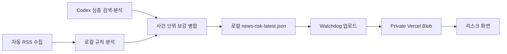

# 뉴스 기반 잠재 리스크 설계

## 1. 목적

기존 리스크 화면은 현재 보유 비중, 목표 편차, 누계 손실, 데이터 상태처럼 이미 관측된 위험을 설명한다. 이번 기능은 최근 경제·금융 뉴스에서 아직 자산 가격이나 비중에 완전히 반영되지 않았을 수 있는 잠재 위험을 별도로 보여준다.

잠재 리스크는 매수·매도 의견이 아니다. 사용자가 확인해야 할 사건, 예상 전달 경로, 관련 자산, 관찰 지표를 설명하는 공식 관찰 항목이다.

## 2. 확정 원칙

- 최근 72시간 뉴스를 분석하고, 24시간 이내 항목은 `신규`로 강조한다.
- 보유 자산 직접 리스크와 시장 전반 잠재 리스크를 분리한다.
- 부정 뉴스 또는 명시적 위험 신호가 있는 중립 뉴스만 잠재 리스크 후보로 사용한다.
- 긍정 뉴스의 기대감 반전 가능성을 억지로 위험 처리하지 않는다.
- 뉴스 잠재 리스크는 기존 수치 기반 위험 수준에 자동 합산하지 않는다.
- 동일 뉴스 위험이 반복되거나 기존 수치 위험과 겹치는 경우에만 위험 중첩 근거를 표시한다.
- 로컬 규칙 분석과 Codex 심층 검색·분석을 병행한다.
- Codex 결과는 생성 즉시 공식 잠재 리스크로 표시한다.
- OpenAI API 자동 호출은 추가하지 않는다.

## 3. 범위

### 포함

- 시장 위험 전용 RSS 검색 주제 추가
- 로컬 규칙 기반 뉴스 위험 분류
- Codex 심층 검색 결과의 보강 병합
- RSS와 Codex 결과의 사건 단위 중복 제거
- 뉴스 잠재 리스크 전용 cloud-safe payload
- Vercel Blob 저장 및 업로드
- 리스크 화면의 뉴스 기반 잠재 리스크 영역
- 신규·활성·갱신 필요 상태
- 원문 링크, 관련 자산, 예상 전달 경로, 반대 근거, 관찰 지표 표시

### 제외

- OpenAI API 자동 분석
- 자동 매수·매도 의견
- 뉴스 위험을 기존 수치 기반 위험 수준에 자동 합산
- 사용자 승인·편집 UI
- 뉴스 원문 전체 저장
- 뉴스 전문 유료 데이터 공급자 연동

## 4. 시스템 구조



뉴스 데이터는 자산 원장 및 `dashboard_payload_v2`와 분리한다. 뉴스 수집 실패가 자산 동기화를 막지 않고, 자산 API 실패가 뉴스 잠재 리스크 갱신을 막지 않아야 한다.

## 5. 뉴스 수집

### 5.1 자동 RSS 수집

기존 보유 자산 관련 검색 주제를 유지하고 다음 시장 위험 전용 주제를 추가한다.

- 금리·국채·중앙은행
- 물가·CPI·인플레이션
- 달러·원화·환율
- 경기 둔화·침체·고용
- 금융 규제·가상자산 규제
- 지정학 충돌·무역 갈등
- 시장 유동성·자금 유출·신용 위험

자동 RSS 수집은 기존 Watchdog 뉴스 수집 경로를 사용한다. 저장 대상은 제목, 요약, 출처, URL, 발행 시각, 분류 결과뿐이며 기사 원문 전체는 저장하지 않는다.

### 5.2 Codex 심층 검색

Codex 심층 검색은 다음 상황에서 함께 실행한다.

- 정기 리포트 작성
- 사용자가 주요 분석 작업을 요청
- 사용자가 뉴스 잠재 리스크 수동 갱신을 요청

출처는 국내외 신뢰도 높은 출처를 혼용한다.

1. 한국은행, 금융당국, 한국거래소, Fed, 정부기관, 기업 공시, 공식 거래소 등 1차 출처
2. Reuters, Bloomberg 등 주요 매체
3. 기타 출처는 핵심 사실의 단독 근거로 사용하지 않는다.

Codex 분석은 한국어로 저장하며 원문 URL과 분석 생성 시각을 반드시 포함한다.

## 6. 잠재 리스크 판정

### 6.1 후보 조건

다음 중 하나를 만족하고, 보유 자산 또는 자산군에 대한 연결 근거가 있을 때만 후보로 만든다.

- 뉴스 방향이 `부정`
- 중립 뉴스에 명시적 위험 키워드가 존재

명시적 위험 키워드는 다음 범주를 포함한다.

- 금리 인상, 긴축, 국채금리 급등
- 규제, 거래 제한, 보안 사고
- 침체, 경기 둔화, 고용 악화
- 자금 유출, 유동성 축소, 신용 위험
- 지정학 충돌, 제재, 무역 갈등

### 6.2 위험 영역

#### 보유 자산 직접 리스크

기사 또는 사건이 특정 보유 종목이나 테마에 직접 연결된다. `related_assets`는 실제 보유 종목 심볼을 포함해야 한다.

#### 시장 전반 잠재 리스크

거시경제·금융환경 변화가 하나 이상의 자산군에 전달될 가능성이 있다. `related_asset_groups`와 예상 전달 경로를 포함해야 한다.

연결 근거가 없는 일반 뉴스는 표시하지 않는다.

### 6.3 우선순위

우선순위는 `긴급 확인`, `주의`, `관찰` 세 단계다.

점수 입력 요소:

- 관련 자산의 총 포트폴리오 비중
- 직접 관련 여부
- 독립 출처 및 반복 기사 수
- 출처 신뢰도
- 위험 키워드 강도
- 24시간 이내 신규성
- 기존 수치 위험과의 중첩 여부

초기 버전은 다음 설명 가능한 점수를 사용한다.

| 요소 | 점수 |
| --- | --- |
| 관련 자산 비중 | 30% 이상 `+3`, 15% 이상 `+2`, 그 외 연결된 비중 `+1` |
| 특정 보유 자산에 직접 관련 | `+2` |
| 독립 출처 수 | 3개 이상 `+2`, 2개 `+1` |
| 출처 신뢰도 | 1차 출처 포함 `+2`, Reuters 또는 Bloomberg 포함 `+1` |
| 위험 키워드 강도 | 강한 위험 신호 `+2`, 일반 위험 신호 `+1` |
| 24시간 이내 신규 | `+1` |
| 기존 수치 위험과 중첩 | `+1` |

- 총점 9점 이상: `urgent`
- 총점 5점 이상 8점 이하: `caution`
- 총점 1점 이상 4점 이하: `watch`

각 잠재 리스크에는 실제 반영된 점수 근거를 `priority_reasons`에 저장한다. 점수가 0점인 항목은 표시하지 않는다.

## 7. RSS와 Codex 보강 병합

### 7.1 사건 식별

동일 사건 여부는 다음 항목을 정규화해 판단한다.

- 핵심 주제
- 관련 자산 및 자산군
- 제목의 핵심 키워드
- 출처 URL

동일 사건의 RSS 기사와 Codex 검색 결과는 하나의 잠재 리스크로 병합한다.

`risk_id`는 정규화한 핵심 주제, 범위, 정렬된 관련 자산 및 자산군을 결합한 뒤 SHA-256 해시 앞 16자를 사용한다. 출처 URL과 제목 전체는 변경 가능성이 높으므로 `risk_id` 생성에는 사용하지 않는다.

### 7.2 병합 규칙

- RSS 규칙 분석 결과는 자동 기본값으로 유지한다.
- Codex는 확인된 사실, 예상 전달 경로, 반대 근거, 관찰 지표를 보강한다.
- Codex가 발견한 신규 사건은 별도 잠재 리스크로 추가한다.
- Codex가 기존 위험 수준 또는 해석을 수정하면 `change_reason`을 기록한다.
- Codex 결과는 생성 즉시 공식 잠재 리스크로 표시한다.
- Codex 분석이 없거나 오래되어도 RSS 규칙 분석은 계속 표시한다.

## 8. 데이터 계약

뉴스 잠재 리스크는 `news_risk_payload_v1`로 저장한다.

로컬 최신 파일:

```text
snapshots/news_risk_latest.json
```

Vercel Blob 키:

```text
dashboard/news-risk-latest.json
```

최상위 필드:

```json
{
  "schema_version": "news_risk_payload_v1",
  "generated_at": "ISO-8601",
  "lookback_hours": 72,
  "rss_generated_at": "ISO-8601 또는 null",
  "codex_generated_at": "ISO-8601 또는 null",
  "status": "actual | delayed | refresh_required",
  "direct_risks": [],
  "market_risks": []
}
```

잠재 리스크 필드:

```json
{
  "risk_id": "안정적인 사건 식별자",
  "scope": "direct | market",
  "priority": "urgent | caution | watch",
  "title": "위험 사건 제목",
  "category": "금리 | 환율 | 경기 | 규제 | 지정학 | 유동성 | 산업",
  "source_type": ["rss_rule", "codex_research"],
  "facts": ["확인된 사실"],
  "potential_impact": "예상 영향",
  "transmission_path": "예상 전달 경로",
  "related_assets": ["BTC"],
  "related_asset_groups": ["coin"],
  "related_asset_weight_pct": 16.21,
  "watch_indicators": ["관찰 지표"],
  "counter_evidence": ["반대 근거"],
  "priority_reasons": ["우선순위 근거"],
  "source_links": [{"title": "출처명", "url": "https://..."}],
  "first_seen_at": "ISO-8601",
  "last_updated_at": "ISO-8601",
  "freshness": "new | active | refresh_required",
  "change_reason": "변경 이유 또는 null"
}
```

payload에는 수량, 평단, 계좌 식별자, API 키, 뉴스 원문 전체를 포함하지 않는다.

Codex 보강 입력은 `codex_news_risk_v1`로 저장한다.

```json
{
  "schema_version": "codex_news_risk_v1",
  "generated_at": "ISO-8601",
  "risks": [
    {
      "risk_id": "기존 사건 식별자 또는 null",
      "scope": "direct | market",
      "title": "위험 사건 제목",
      "category": "금리 | 환율 | 경기 | 규제 | 지정학 | 유동성 | 산업",
      "facts": ["확인된 사실"],
      "potential_impact": "예상 영향",
      "transmission_path": "예상 전달 경로",
      "related_assets": ["BTC"],
      "related_asset_groups": ["coin"],
      "watch_indicators": ["관찰 지표"],
      "counter_evidence": ["반대 근거"],
      "source_links": [{"title": "출처명", "url": "https://..."}],
      "change_reason": "기존 사건 해석 변경 이유 또는 null"
    }
  ]
}
```

기존 사건을 보강할 때는 `risk_id`가 필수다. 신규 사건은 `risk_id`를 `null`로 제출하고 Watchdog이 검증 후 안정적인 식별자를 생성한다.

## 9. 갱신 및 상태

- 최근 24시간 이내 생성·갱신된 잠재 리스크는 `new`
- 24시간 초과 72시간 이내는 `active`
- 72시간 초과 Codex 분석 또는 사건은 `refresh_required`
- RSS 수집 실패 시 기존 최신 payload를 유지하고 최상위 상태를 `delayed`로 표시
- Codex 분석이 없으면 RSS 규칙 분석만 표시
- Codex 분석이 72시간을 넘으면 화면에 `Codex 분석 갱신 필요` 표시

최상위 상태 우선순위는 `delayed`, `refresh_required`, `actual` 순이다. RSS 수집 실패가 있으면 `delayed`, RSS는 정상이지만 표시 중인 Codex 분석이 72시간을 넘으면 `refresh_required`, 그 외에는 `actual`이다.

## 10. 리스크 화면

기존 수치 기반 리스크 화면 아래에 뉴스 기반 잠재 리스크 영역을 추가한다.

### 10.1 요약

- 보유 자산 직접 리스크 건수
- 시장 전반 잠재 리스크 건수
- 최근 24시간 신규 위험 건수
- Codex 심층 분석 최신 시각
- 갱신 필요 여부

### 10.2 데스크톱

- 좌측: 보유 자산 직접 리스크
- 우측: 시장 전반 잠재 리스크
- 각 영역은 우선순위순으로 최대 5건을 기본 표시
- 나머지 항목은 접힌 상세 목록에 보관

### 10.3 모바일

- 보유 자산 직접 리스크를 먼저 표시
- 시장 전반 잠재 리스크를 이어서 표시
- 카드 기본 상태에서 우선순위, 제목, 관련 자산, 핵심 영향을 표시
- 상세보기에서 사실, 전달 경로, 관찰 지표, 반대 근거, 출처 링크를 표시

### 10.4 표시 원칙

- `RSS 규칙 분석`, `Codex 심층 분석` 출처 배지를 표시
- 사실, 예상 영향, 추정을 시각적으로 구분
- 뉴스 잠재 리스크는 기존 수치 기반 현재 위험 수준과 분리
- 동일 위험이 수치 기반 위험과 겹치면 `기존 위험과 중첩` 근거를 표시
- 매수·매도 추천 표현을 사용하지 않는다.

## 11. CLI 및 운영 흐름

Watchdog CLI에 뉴스 잠재 리스크 전용 동기화 흐름을 추가한다.

- `collect-news-risks [--sync-dashboard]`: 자동 RSS 수집 후 로컬 규칙 위험 생성
- `merge-news-risks --path <codex.json> [--sync-dashboard]`: Codex 보강 결과 검증 및 병합
- `sync-news-risks --path <news-risk.json>`: 별도 뉴스 리스크 payload 업로드
- 자산 대시보드 동기화와 뉴스 리스크 동기화를 독립 실행 가능

Codex 심층 분석 결과는 구조화 JSON으로 저장한 뒤 Watchdog 병합 명령을 통해 검증·업로드한다. Codex가 Vercel Blob에 직접 쓰지 않는다.

## 12. 오류 처리

- RSS 수집 실패: 기존 payload 유지, `delayed` 표시
- Codex 결과 없음: RSS 결과만 표시
- Codex 결과 72시간 초과: `refresh_required` 표시
- 연결 근거 부족: 잠재 리스크에서 제외하고 로컬 로그에 제외 이유 기록
- 잘못된 payload 또는 민감 필드 포함: 저장 및 업로드 거부
- 개별 출처 URL 오류: 해당 링크만 제외하고 사건은 유지
- 뉴스 리스크 Blob 없음: 리스크 화면에 명확한 빈 상태 표시

출처 링크는 `https://` 또는 `http://`만 허용한다. 사용자 정보가 포함된 URL, 로컬 주소, `javascript:`, `data:` 등 실행 가능하거나 내부 접근을 유발하는 URL은 저장 및 화면 표시에서 제외한다.

## 13. 테스트 및 검증

### Python

- 부정 뉴스가 잠재 리스크로 생성되는지 확인
- 위험 키워드가 있는 중립 뉴스가 생성되는지 확인
- 긍정 뉴스가 잠재 리스크로 잘못 생성되지 않는지 확인
- 직접 리스크와 시장 전반 잠재 리스크 분리
- 관련 자산 비중 및 우선순위 계산
- 동일 사건 RSS·Codex 중복 제거
- Codex 보강 필드 및 변경 이유 병합
- 동일 사건 입력에서 안정적인 `risk_id` 생성
- 우선순위 점수 경계값 및 근거 생성
- 24시간 `new`, 72시간 `refresh_required`
- 민감 필드 업로드 차단
- 위험한 출처 URL 차단
- RSS 실패 시 기존 payload 유지

### Next.js

- 뉴스 리스크 payload 검증
- 직접·시장 리스크 영역별 최대 5건 기본 표시
- Codex 분석 없음·오래됨 상태
- source_type, facts, transmission_path, watch_indicators 표시
- 원문 링크 안전 표시
- 긴 제목과 다수 관련 자산 표시

### 운영 QA

- 데스크톱 2열 및 모바일 1열 배치
- 긴 제목과 태그로 인한 가로 넘침 없음
- 자산 데이터와 뉴스 데이터 생성 시각 분리 표시
- 잘못된 뉴스 payload가 기존 리스크 화면을 깨뜨리지 않음
- Vercel 런타임 오류 없음

## 14. 완료 기준

- 최근 72시간 자동 RSS 뉴스에서 설명 가능한 잠재 리스크를 생성한다.
- Codex 심층 검색 결과가 기존 위험을 보강하거나 신규 사건을 추가한다.
- 동일 사건이 RSS와 Codex 결과로 중복 표시되지 않는다.
- 보유 자산 직접 리스크와 시장 전반 잠재 리스크가 분리 표시된다.
- 각 잠재 리스크에 사실, 예상 전달 경로, 관련 자산, 관찰 지표, 출처가 있다.
- 뉴스 잠재 리스크가 기존 수치 기반 위험 수준과 혼동되지 않는다.
- 민감 정보가 로컬 밖으로 업로드되지 않는다.
